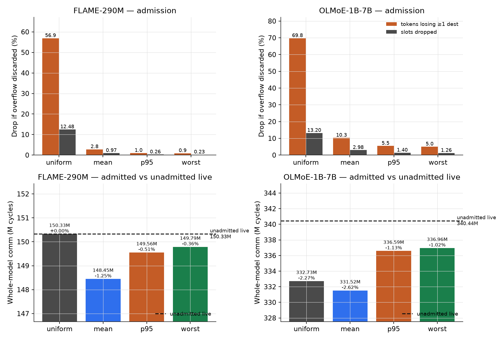
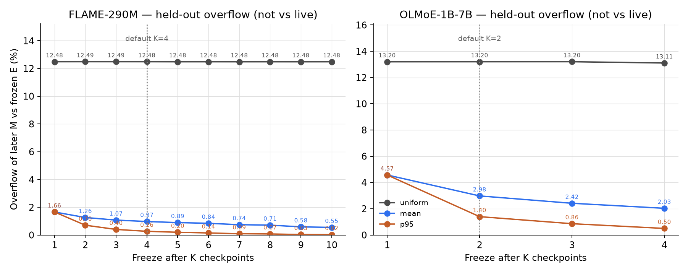
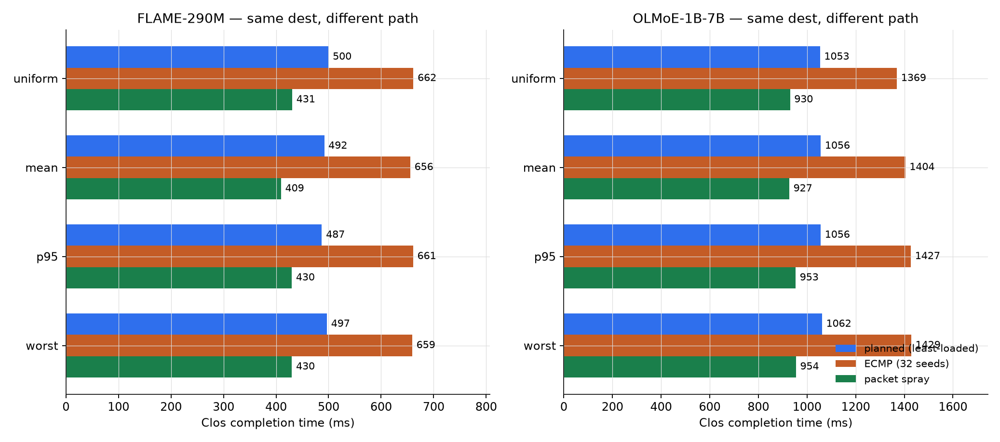
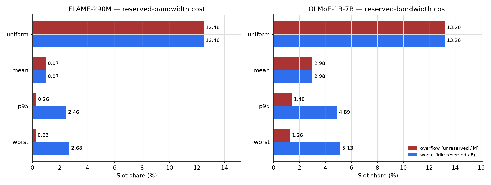
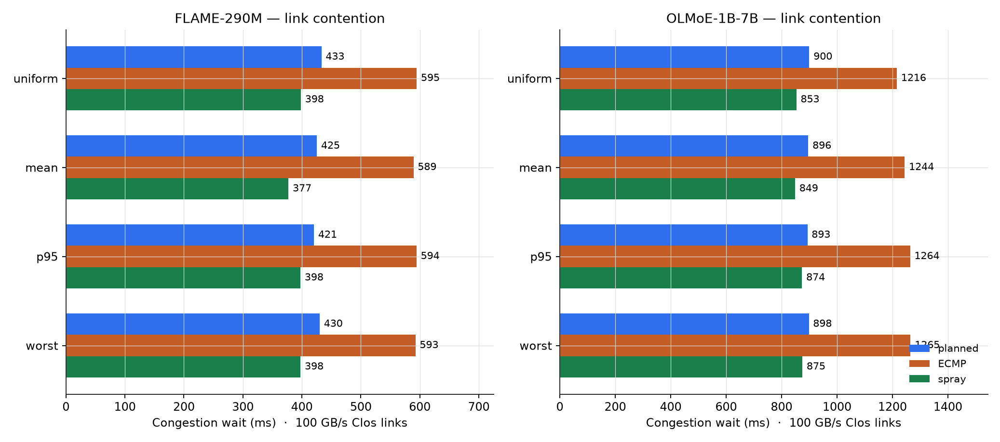

# Stage 1: frozen P95 reservation and Clos least-loaded paths
| | |
|---|---|
| Question | Does a per-layer P95 reservation `E` with Clos least-loaded paths, frozen after a few early checkpoints, still fit later traffic, and what does it cost? |
| Inputs | FLAME-MoE-290M: 8 MoE layers (`02`–`09`), 250k-token prefix (file is 52.4M), top-6, freeze after 4 ckpts (540–2160), 7 held-out ckpts. OLMoE-1B-7B: 16 layers (`0`–`15`), 205k prefix (file is 762k), top-8, freeze after 2 ckpts, 3 held-out. |
| Model | Fig 1–2: ASTRA-sim Switch 8×100 GB/s, sizes only, whole model = sum of every layer's dispatch+combine. Fig 3, 4b: the planner's 2-pod Clos, 100 GB/s links. Fig 4a: slot counts on held-out `M`, no simulator. |
| Reproduce | `plane experiment --suite claim-v1 -o plane/output`; `plane experiment --suite clos-baselines -o plane/output`; `python plane/scripts/flagship_stage1.py` |
| Outputs | `plane/output/stage1-flagship/figures/fig1_admission.png`, `fig2_freeze.png`, `fig3_clos.png`, `fig4a_reserve.png`, `fig4b_links.png` |
## Setup
- Policies uniform, mean, P95, worst; admission `sent = min(M, E)`, no deflection.
- Unadmitted live = the later checkpoint's real matrix `M` with no clip (dashed line, Fig 1); admitted bars send `min(M, E)`.
- Plan = least-loaded one path; ECMP = 32-seed hash; spray = split each pair across all equal-cost paths.
## Results
### Fig 1. Admission on the Switch; dashed line = unadmitted live (FLAME 150.33M cycles, OLMoE 340.44M)

Uniform drops a dest for 56.9% / 69.8% of tokens. P95: 1.02% / 5.49% tokens, 0.26% / 1.40% slots. Admitted Switch vs unadmitted live: P95 −0.51% / −1.13%.
### Fig 2. Overflow of later `M` vs `E` frozen after K; dotted line = default freeze (K=4 / K=2)

Always-replan is within 0.35% of the default freeze on admitted Switch time. FLAME P95 overflow 1.66%→0.26% by K=4; OLMoE 4.57%→1.40% by K=2. Uniform stays ~12.5–13.2%.
### Fig 3. Clos path choice, same admitted last-checkpoint graphs

| | FLAME plan | FLAME ECMP | FLAME spray | OLMoE plan | OLMoE ECMP | OLMoE spray |
|---|---:|---:|---:|---:|---:|---:|
| uniform | 500 ms | 662 ms | 431 ms | 1053 ms | 1370 ms | 930 ms |
| mean | 492 ms | 656 ms | 409 ms | 1056 ms | 1404 ms | 927 ms |
| p95 | 487 ms | 661 ms | 430 ms | 1056 ms | 1427 ms | 953 ms |
| worst | 497 ms | 659 ms | 430 ms | 1062 ms | 1429 ms | 954 ms |
### Fig 4a. Reserved bandwidth on held-out `M`: overflow = demand above `E`, waste = reserved slots not used

| Policy | FLAME overflow | FLAME waste | OLMoE overflow | OLMoE waste |
|---|---:|---:|---:|---:|
| uniform | 12.48% | 12.48% | 13.20% | 13.20% |
| mean | 0.97% | 0.97% | 2.98% | 2.98% |
| p95 | 0.26% | 2.46% | 1.40% | 4.89% |
| worst | 0.23% | 2.68% | 1.26% | 5.13% |
### Fig 4b. Link contention: congestion wait = Clos makespan − uncontended ideal; GB-equivalent = congestion_s × 100 GB/s

| | FLAME planned | FLAME ECMP | FLAME spray | OLMoE planned | OLMoE ECMP | OLMoE spray |
|---|---:|---:|---:|---:|---:|---:|
| uniform | 433 ms · 43.3 GB | 595 ms · 59.5 GB | 398 ms · 39.8 GB | 900 ms · 90.0 GB | 1216 ms · 121.6 GB | 853 ms · 85.3 GB |
| mean | 425 ms · 42.6 GB | 589 ms · 58.9 GB | 377 ms · 37.7 GB | 896 ms · 89.6 GB | 1244 ms · 124.4 GB | 849 ms · 84.9 GB |
| p95 | 421 ms · 42.1 GB | 594 ms · 59.4 GB | 398 ms · 39.8 GB | 893 ms · 89.3 GB | 1264 ms · 126.4 GB | 874 ms · 87.4 GB |
| worst | 430 ms · 43.0 GB | 593 ms · 59.3 GB | 398 ms · 39.8 GB | 898 ms · 89.8 GB | 1265 ms · 126.5 GB | 875 ms · 87.5 GB |
## Finding
- P95 admitted Switch time within −0.51% / −1.13% of unadmitted live; 1.02% / 5.49% of tokens lose a slot.
- Always-replan is within 0.35% of the default freeze; uniform drops a dest for 56.9% / 69.8% of tokens.
- P95 plan vs ECMP 1.36× / 1.35×; vs spray 0.88× / 0.90×; ranking independent of reservation policy.
- P95 idle reserve 2.46% / 4.89%; plan vs ECMP saves 17.3 GB / 37.1 GB of the contention proxy.
## Limits
- Admitted bars can sit under live because leftover bytes never enter the network; not a speedup. DCQCN, ns-3, runtime deflection and reconfiguration out of scope.
- Prefix traces only; see `full-trace-sanity.md` (FLAME dest-share cosine 0.9999, P95 overflow 0.14%→0.33%).
