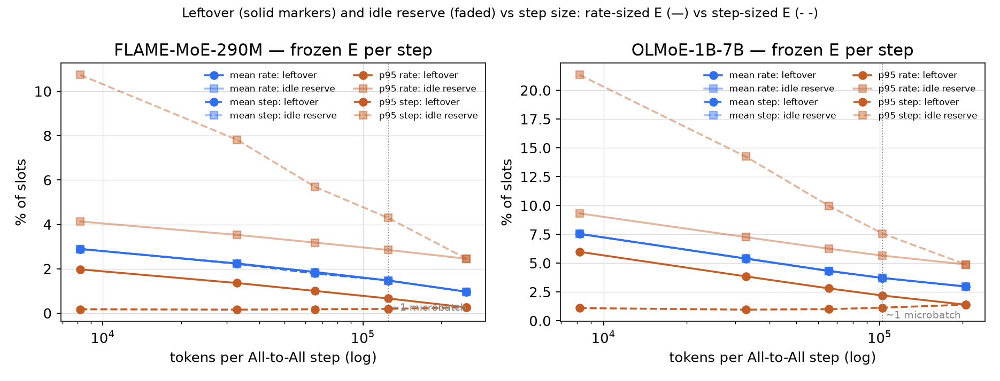
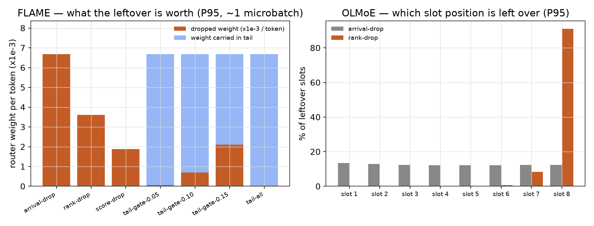
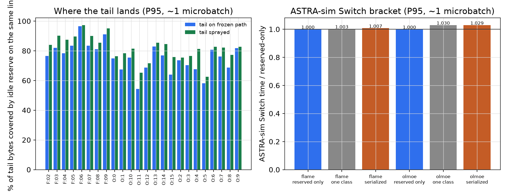
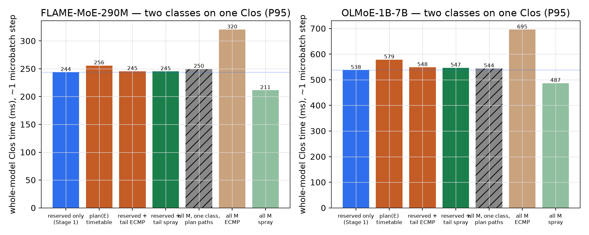
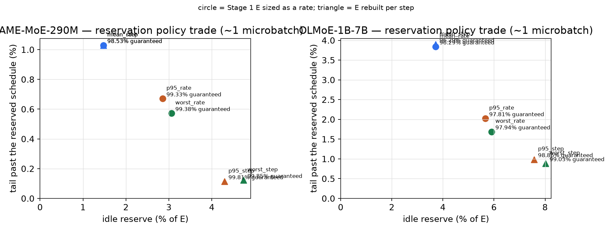
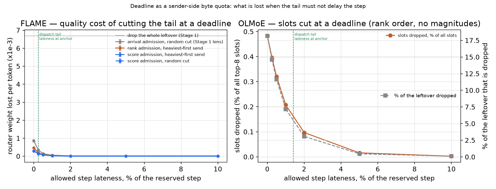
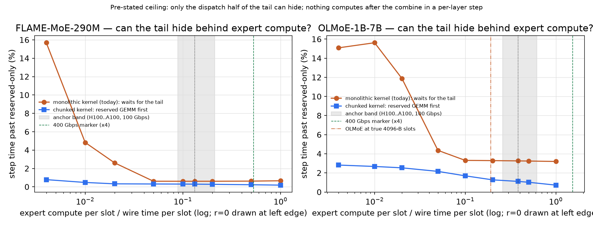
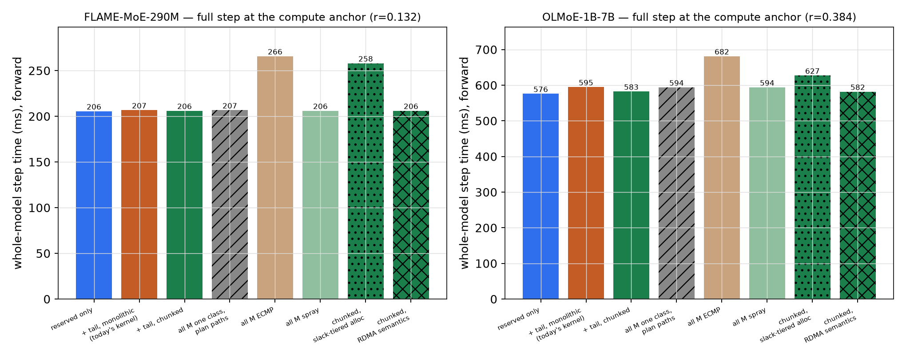

# Stage 2: the leftover of a frozen plan, carried, cut or hidden
| | |
|---|---|
| Question | With the Stage 1 plan enforced per step as a strict-priority quota, how large is the leftover, what is it worth, and what does carrying, cutting or hiding it cost? |
| Inputs | FLAME-MoE-290M: 250k prefix, top-6, membership lens (6 slots per token), `E` = Stage 1 P95 (K=4), 7 held-out ckpts. OLMoE-1B-7B: 205k prefix, top-8 (8 slots), `E` = Stage 1 P95 (K=2), 3 held-out ckpts plus different-token steps from the cached full file. Steps `B`: 8k, 32k, 65k, 125k (~1 microbatch), 250k / 8k, 32k, 65k, 102k, 205k. |
| Model | numpy (slots, weights, links); ASTRA-sim Switch (sizes only, bracket); the planner's 2-pod Clos, 100 Gbps links, strict priority between classes, max-min fair share within a class (slack-tiered allocation as sensitivity); one fluid step per layer: dispatch, expert kernel(s), combine; whole model = sum over layers. |
| Reproduce | `plane experiment --suite stage2-runtime -o plane/output` (all stages, ~1.5 h); `--stages step` (Stage 2b only, ~10 min); `.venv/bin/python plane/scripts/flagship_stage2.py`; `.venv/bin/python -m pytest plane/tests -q`. `MOE_STAGE2_QUICK=1` limits to one layer per model; `moe_feeder.stage2.resummarize(out/'stage2')` rebuilds `summary.json` from the CSVs. |
| Outputs | `plane/output/stage2/summary.json`; `plane/output/stage2/figures/fig1_granularity.png` to `fig8_step_bars.png`; ns-3 inputs under `plane/output/stage2/ns3/` (not run) |
## Setup
- Classes: reserved = `min(M, floor E)` per cell, priority 0, frozen paths; tail = `M − reserved`, same destinations, priority 1 (dispatch) / 2 (combine), on ECMP or spray. Admission order: arrival, descending router score (FLAME), or ascending slot rank.
- Deadline = sender-side byte quota per tail cell, read off the plan's rate schedules at `T_reserved_dispatch + L` minus one slot; cut plan re-planned and verified; sender ships heaviest first.
- Kernels: monolithic (starts after both classes land) or chunked (reserved-chunk GEMM first, tail chunk after, two combines); launch floor 30 µs.
- Compute-to-wire ratio `r`: anchor 0.13 (band 0.09–0.21) FLAME, 0.38 (band 0.26–0.61; 0.19 on true 4096-B slots) OLMoE; slot = 2048 bytes, 164 ns at 100 Gbps; FLOPs per slot 6·1024·704 = 4.3 MFLOP / 6·2048·1024 = 12.6 MFLOP at 200 TFLOP/s effective.
## Results
### Fig 1. Leftover and idle reserve per step; `E` sized as a rate (`E·B/N`) or per step

| step tokens | FLAME P95 rate: leftover / idle | FLAME P95 step: leftover / idle / `E` size | OLMoE P95 rate | OLMoE P95 step |
|---|---:|---:|---:|---:|
| 250k / 205k (Stage 1) | 0.26% / 2.46% | same | 1.40% / 4.89% | same |
| 125k / 102k (~1 microbatch) | 0.67% / 2.85% | 0.19% / 4.30% / 1.02× | 2.19% / 5.66% | 1.14% / 7.57% / 1.03× |
| 32k | 1.36% / 3.53% | 0.16% / 7.82% / 1.06× | 3.85% / 7.26% | 0.97% / 14.25% / 1.12× |
| 8k | 1.98% / 4.13% | 0.18% / 10.74% / 1.09× | 5.99% / 9.32% | 1.10% / 21.34% / 1.22× |
Tokens losing at least one reserved slot at ~1 microbatch: 2.4% / 8.4%. Different-token OLMoE steps: leftover 2.83% (aligned 2.19%). Per-cell counts over-dispersed (CV/Poisson 1.4 to 9.6).
### Fig 2. Router weight of the leftover, FLAME, P95, ~1 microbatch

| FLAME, P95, ~1 microbatch | weight lost per token | mean weight of a shed slot |
|---|---:|---:|
| arrival-order drop (Stage 1) | 6.7e-3 | 0.167 (an average slot) |
| rank-order drop | 3.6e-3 (1.9× cheaper) | 0.092 |
| score-order drop | 1.9e-3 (3.6× cheaper) | 0.048 |
| gate: drop only if weight ≤ 0.05 / 0.10 / 0.15 | removes 3% / 24% / 52% of the leftover | |
On OLMoE rank order concentrates 91% of the leftover on the 8th expert.
### Fig 3. Where the tail lands, and the ASTRA-sim bracket (P95, ~1 microbatch)

| P95, ~1 microbatch | FLAME | OLMoE |
|---|---:|---:|
| refund bytes / tail bytes, aggregate | 4.1× | 2.8× |
| tail bytes covered on the same link, tail on frozen path / sprayed | 84% / 90% | 71% / 78% |
| links (of 48) with more tail than refund | ~5 | ~10 |
| ASTRA-sim Switch: one class / reserved-then-tail, vs reserved-only | +0.3% / +0.7% | +3.0% / +2.9% |
### Fig 4 and 5. Dispatch-only two classes and the sizing knob (slack-tiered allocator, ~1 microbatch, P95 rate)

Reserved-only 243.9 / 537.5 ms; reserved + tail 245.5 (+0.67%) / 548.4 (+2.02%); all `M` one class on plan paths 249.7 / 543.8; all `M` ECMP 320.3 / 695.5. Reserved schedule identical with or without the tail (2e-16). Mean instead of P95: +0.4 / +1.8 points of tail lateness; per-step sizing: near-zero tail for +1.5 / +2 points of idle reserve.
### Fig 6. Tail cut at a deadline: full step per layer, anchor compute, tail on ECMP (4 seeds); x = allowed lateness as fraction of the reserved step

| allowed lateness | FLAME: tail dispatch delivered | slots cut (% of all) | weight lost, score admission + heaviest-first | arrival admission + random | OLMoE: delivered | slots cut (% of all) | of them rank 8 |
|---|---:|---:|---:|---:|---:|---:|---:|
| 0 | 84.5% | 0.085% | 0.28e-3 | 0.86e-3 | 79.9% | 0.48% | 96% |
| 0.25% | 93.0% | 0.033% | 0.13e-3 | 0.34e-3 | 83.9% | 0.40% | 96% |
| 0.5% | 96.6% | 0.014% | 0.07e-3 | 0.14e-3 | 87.3% | 0.32% | 97% |
| 1% | 98.7% | 0.006% | 0.02e-3 | 0.06e-3 | 92.1% | 0.21% | 98% |
| 2% | 99.6% | 0.002% | 0.001e-3 | 0.02e-3 | 96.5% | 0.10% | 99% |
| 5% | 99.6% | 0.002% | 0.001e-3 | 0.02e-3 | 99.5% | 0.016% | 100% |
Drop-everything cost 6.7e-3 per token on FLAME; seed spread 0.02e-3; max overshoot 0 at every lateness. OLMoE different-token steps: 0.56% cut at zero lateness, 0.13% at 2%. With r = 0 only 78% / 73% of the tail can be delivered and the cut costs 0.12% / 0.63% of slots.
### Fig 7. Step time past reserved-only, whole model, vs compute-to-wire ratio `r`; ECMP tail, fair share

| `r` | FLAME monolithic / chunked | tail dispatch late by | OLMoE monolithic / chunked | tail dispatch late by |
|---|---:|---:|---:|---:|
| 0 (no compute) | +15.7% / +0.78% | 82 ms | +15.1% / +2.8% | 212 ms |
| 0.02 | +2.6% / +0.33% | 18 ms | +11.9% / +2.5% | 195 ms |
| 0.05 | +0.61% / +0.31% | 0.5 ms | +4.4% / +2.2% | 140 ms |
| 0.10 | +0.61% / +0.30% | 0.5 ms | +3.3% / +1.7% | 27 ms |
| anchor (0.13 / 0.38) | +0.61% / +0.29% | 0.5 ms | +3.3% / +1.1% | 8 ms |
| 1.0 | +0.66% / +0.19% | 0.5 ms | +3.2% / +0.72% | 8 ms |
### Fig 8. One full step at the anchor (~1 microbatch, forward, fair share)

| ~1 microbatch, forward, anchor `r`, fair share | FLAME | OLMoE |
|---|---:|---:|
| reserved only (tail dropped) | 205.6 ms | 576.1 ms |
| + tail, monolithic kernel (today) | 206.8 (+0.61%) | 594.9 (+3.3%) |
| + tail, chunked kernel | 206.1 (+0.29%) | 582.5 (+1.1%) |
| + tail, chunked, sprayed | 206.1 | 582.7 |
| all `M`, one class, plan paths (no reservation) | 206.7 | 594.1 |
| all `M`, ECMP | 265.8 (1.29×) | 681.6 (1.18×) |
| all `M`, spray | 206.2 | 594.2 |
## Finding
- Per-step quota carries 99.3% / 97.8% of bytes on the Stage 1 timetable; leftover 0.67% / 2.19% at ~1 microbatch.
- Leftover carries average weight (0.167 per slot); score order makes shedding 3.6× cheaper.
- Monolithic kernel: tail costs +0.61% / +3.3% at the anchor, ~15% at r = 0; chunked kernel +0.29% / +1.1%.
- Cut at zero lateness loses 0.085% / 0.48% of slots at 0.28e-3 weight per token, 24× below dropping the leftover.
## Limits
- Strict priority is ideal preemption; PFC, DCQCN, NIC rate-limiter granularity and spray reorder are packet-level and not run.
- Quality is router weight (FLAME) or slot rank (OLMoE), never loss; OLMoE trained dropless. Backward pass, shared expert and 1F1B overlap not modelled; OLMoE absolute times 2× short (4096-byte slot).
